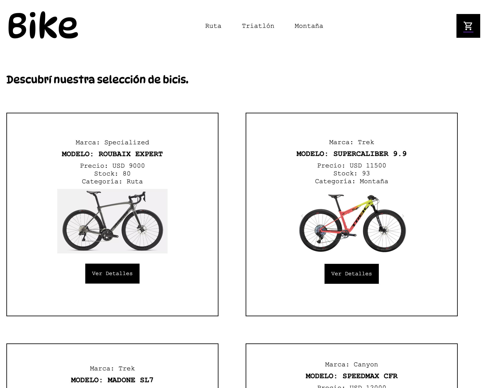
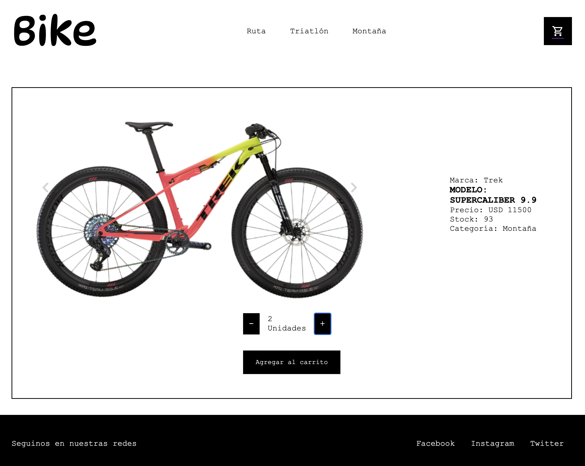

# Descubrí BIKES, un ecommerce de bicicletas.

El proyecto se realizó con [Create React App](https://github.com/facebook/create-react-app).

## ¿De qué se trata el proyecto?

Es un ecommerce con una interface sencilla que permite acceder a productos por categoría y entrar al detalle de cada producto. Permite agregar los productos a un carrito de compras, cambiar las cantidades de los productos elegidos, eliminarlos del carrito de compra y vaciar el carrito. También permite manejar el stock. El proveedor carga un stock inicial en la base de datos y con cada compra se actualiza el stock según la cantidad comprada.

## ¿Qué librerías utiliza?

### React

### [React Router Dom](https://reactrouter.com/en/main)

A nivel técnico, se usaron contextos, estados, rutas y eventos. Como base de datos se utilizó [Firebase](https://firebase.google.com/).

## ¿Cómo bajarlo?

### Paso 1: Clonar el repositorio:
```git clone https://github.com/pabloporolli/bikes-new.git```
### Paso 2: Instalar React:
```npm install```
### Paso 3: Iniciar el proyecto:
```npm start```

## Pull Request

Para crear un pull request deberá crear una rama nueva con su nombre y seguir las instrucciones que provee [Github en el presente link](https://docs.github.com/es/pull-requests/collaborating-with-pull-requests/proposing-changes-to-your-work-with-pull-requests/creating-a-pull-request).

## Imágenes del proyecto

### Home



### Detalle
 
